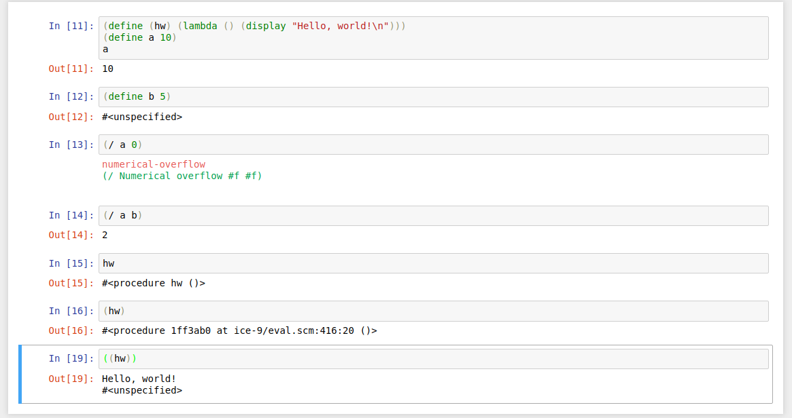

# guile-kernel
Guile kernel for Jupyter Notebook (Written and tested with GNU Guile 2.0.11)

Note: Buffer size in [guile-simple-zmq](https://github.com/jerry40/guile-simple-zmq) is set to 4096 bytes, so code in a Jupyter cell should be shorter than this! In case you need longer code, increase BUF-SIZE in guile-simple-zmq.

Note 2: [FIXED] jupyter notebook 5.6.0 waits for 1 minute after start.

## Example


## Installation
How to get GNU Guile version 2.0.12 or later (https://www.gnu.org/software/guile/manual/html_node/Obtaining-and-Installing-Guile.html):
```
$ wget ftp://ftp.gnu.org/gnu/guile/guile-2.0.12.tar.gz
$ tar xvf guile-2.0.12.tar.gz
$ cd guile-2.0.12
$ ./configure
$ make
$ sudo make install
```

The jupyter notebook is a client and the jupyter kernel is a server. They exchange data with messages placed into message queues provided by ZeroMQ library (http://zeromq.org/). I tested this kernel with ZeroMQ-4.2.1.

How to install it:
```
$ wget https://github.com/zeromq/libzmq/releases/download/v4.2.1/zeromq-4.2.1.tar.gz
$ tar xvf zeromq-4.2.1.tar.gz
$ cd zeromq-4.2.1/
$ ./configure
$ make
$ sudo make install
```

Headers and content of data in a message are streamed in json format. To work with this format, guile needs the library - [guile-json](https://github.com/aconchillo/guile-json). How to install it:
```
$ wget http://download.savannah.gnu.org/releases/guile-json/guile-json-3.2.0.tar.gz
$ tar xvf guile-json-3.2.0.tar.gz
$ cd guile-json-3.2.0
$ ./configure --prefix=<guile-prefix>
$ make
$ sudo make install
```
It can be tricky, I needed to install some additional packages in order to build this library. guile-prefix - is a folder which you need to specify in order to put  the library to right place. Folders where guile searches for libraries are:
```
$ guile -c '(display %load-path) (newline)'
```
To place guile-json to /usr/share/guile/site/ folder I executed ```$ ./configure --prefix=/usr```

In order to get ZeroMQ messages, guile needs another library - [guile-simple-zmq](https://github.com/jerry40/guile-simple-zmq)

It is one guile file which is not needed to be compiled so actually you can place it directly to the guile library folder:
```
$ cd `guile -c "(display (%global-site-dir))"`
$ wget https://raw.githubusercontent.com/jerry40/guile-simple-zmq/master/src/simple-zmq.scm
```

## Kernel setup
According to the [article](http://jupyter-client.readthedocs.io/en/stable/kernels.html), the kernel can be placed into different loactions:

|     |Unix|Windows
| --- | --- | ---
System|/usr/share/jupyter/kernels<br>/usr/local/share/jupyter/kernels| %PROGRAMDATA%\jupyter\kernels
Env   |{sys.prefix}/share/jupyter/kernels|
User  |\~/.local/share/jupyter/kernels (Linux)<br>~/Library/Jupyter/kernels (Mac)|%APPDATA%\jupyter\kernels

Choose one of them and create there a folder ```guile```. After that copy files from ```src``` folder of thos repo and edit file ```kernel.json``` this way: replace ### with the full path to the folder ```guile``` you created):
```
{
    "argv": ["guile", "-s", "###/guile/guile-jupyter-kernel.scm", "--", "{connection_file}"],
    "display_name": "Guile",
    "language": "scheme"
}
```

Example:
```
{
    "argv": ["guile", "-s", "/home/jerry/.local/share/jupyter/kernels/guile/guile-jupyter-kernel.scm", "--", "{connection_file}"],
    "display_name": "Guile",
    "language": "scheme"
}
```

After this, start Jupyter Notebook and check if the guile kernel is visible by it. 
